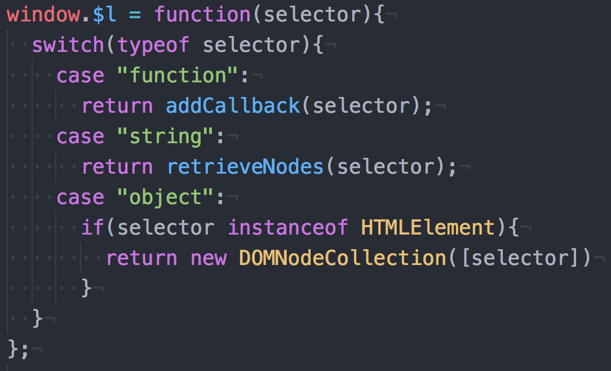

<h1>DOMpler</h1>

<h2>Features</h2>

DOMpler is a program designed to interact with the JavaScript DOM, modeled after JQuery.  
DOMpler has the ability to:
1. Select single or multiple elements
2. Add to or clear the inner HTML of elements
3. Append elements to existing ones
4. Add or Remove classes
5. Add or Remove event listeners
6. Return the parent or children of selected elements
7. Complete ajax requests and handle promises.

<h2>Global Variable</h2>

DOMpler uses $l as a global variable to call the methods in the library.  It can be used to select elements with CSS selectors, create HTML elements which are then wrapped in a DOMNodeCOllection object, or to queue functions to run once the COM has loaded.

<h2>Methods</h2>

1. html: Returns the innerHTML for the first element in the DOMNodeCollection if no argument is given. If a string argument is given, changes the innerHTML of each DOMNodeCollection element to the string argument.
2. empty: empties inner HTML of each DOMNodeCollection element
3. append: Takes a single HTMLElement, DOMNodeCollection, or string argument and appends it to each DOMNodeCollection element.
4. remove: takes a selector argument to specifically remove certain elements from a DOMNodeCollection or will remove all selected elements if no argument is given
5. attr: takes an attribute argument and returns the value of that attribute for the first element in the DOMNodeCollection
6. addClass: takes a class argument to give to each element of the DOMNodeCollection
7. removeClass: takes a class argument to remove from each element of the DOMNodeCollection

<h2>Event Listeners</h2>
1. on: adds an event listener to each element of a DOMNodeCollection.  Requires type and callback arguments.
2. off: removes event listeners from each element of a DOMNodeCOllection. Requires type and callback arguments.

<h2>AJAX Request</h2>

$l.ajax: Sends an HTTP request and returns a promise object. Takes a hash object as an argument. The hash can have the following attributes:
* method: HTTP Request type. Default is 'GET'
* url: url for request
* data: a hash object with any values being sent with the request
* success: callback for completed request
* error: callback for failed request
* contentType: content type of request
